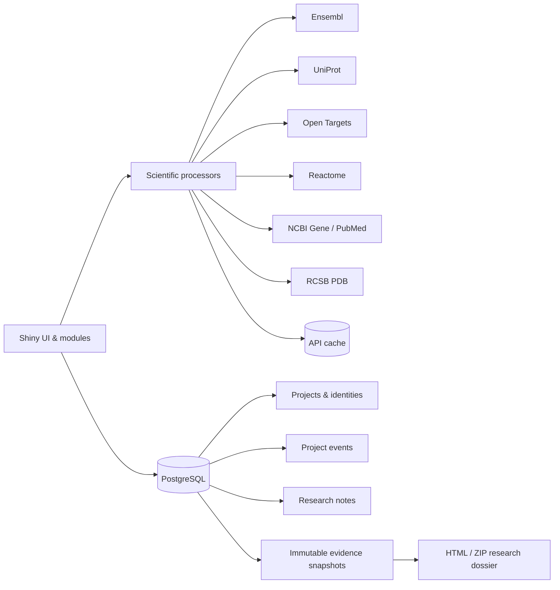

# TargetWeave

**Connected evidence for molecular target investigation.**

TargetWeave is a persistent R Shiny research workspace for investigating and comparing molecular targets within a disease context.

It connects evidence from multiple public biomedical resources, keeps target and disease identities explicit, preserves provenance, and allows researchers to capture immutable evidence snapshots as a project evolves.

**Live app:**  
https://targetweave.onrender.com

> Human-only v1. Scientific evidence is retrieved only after target and disease identities are explicitly confirmed.

---

## What TargetWeave does

Target investigation often requires moving between several disconnected biomedical databases and manually keeping track of identifiers, evidence, and search context.

TargetWeave brings that workflow into one research workspace:

**Investigate → Compare → Connect → Preserve**

A project can contain up to eight candidate targets associated with one confirmed disease context.

Researchers can:

- resolve and confirm canonical gene and protein identities
- inspect gene and protein annotations
- examine target-disease association evidence
- compare Open Targets evidence dimensions across targets
- explore shared and target-specific Reactome pathway membership
- investigate the PubMed literature landscape over time
- inspect experimental RCSB PDB structures in an embedded Mol* viewer
- write research notes
- capture immutable evidence snapshots
- export snapshot-based research dossiers as HTML/ZIP

---

## Evidence workspace

### Overview

Per-target annotation from Ensembl and UniProt, including canonical identifiers, genomic context, protein information, function, and cellular location.

### Disease evidence

Target-disease evidence from Open Targets using a confirmed ontology disease identity.

Direct association evidence and broader ontology-aware evidence are kept conceptually distinct.

### Compare evidence

Cross-target comparison of Open Targets evidence dimensions.

Values remain source-specific. TargetWeave does **not** create a composite target score or rank targets as better or worse.

### Pathways

Reactome pathway membership across confirmed targets.

The overlap matrix helps show where pathway memberships are shared or differ.

Pathway membership is **not** interpreted as pathway activity, enrichment, or biological importance.

### Literature

PubMed records linked through the target's NCBI Gene record and filtered by the confirmed disease context.

The workspace includes:

- total matched records
- annual publication activity
- year-specific publication exploration
- recent records
- searchable yearly results
- explicit query definition and provenance

Publication volume is presented as literature availability, not scientific importance.

### Experimental structures

Experimentally determined structures retrieved from RCSB PDB.

The workspace includes:

- experimental PDB entry counts
- searchable structure records
- experimental method
- resolution
- sequence coverage
- chains and entity metadata
- non-polymer chemical components
- direct RCSB links
- embedded RCSB Mol* structure inspection

**Predicted structures are not included in v1.**

---

## Scientific design principles

TargetWeave intentionally avoids several shortcuts that can make integrated biomedical tools misleading.

- Open Targets association scores are not presented as probabilities.
- Publication count is not treated as target importance.
- Pathway membership is not treated as pathway activity or enrichment.
- PDB entry count is not interpreted as structural evidence quality.
- Missing data, true zero, retrieval failure, and not-yet-retrieved states remain distinct.
- Experimental structures and predicted structures are conceptually separated.
- No cross-source composite score is generated.

Confirmed canonical identities drive downstream retrieval.

---

## Persistent research projects

TargetWeave is more than a collection of API queries.

Each user has a persistent private workspace backed by PostgreSQL.

Projects support:

- confirmed and unresolved target identities
- adding, removing, and re-adding targets
- explicit disease identity confirmation
- target-set change tracking
- append-only project history
- stale-evidence detection when the scientific target set changes
- research notes
- immutable evidence snapshots
- snapshot-based exports

Old snapshots are never rewritten when the live project changes.

---

## Data sources

| Source | Used for |
| --- | --- |
| **Ensembl** | Gene identity and genomic context |
| **UniProt** | Protein identity and annotation |
| **Open Targets** | Target-disease association evidence |
| **Reactome** | Pathway membership |
| **NCBI Gene / PubMed** | Target-linked literature landscape |
| **RCSB PDB** | Experimental macromolecular structures |

Account email, project notes, and private research text are not sent to scientific APIs.

Only the identifiers and scientific query terms required for retrieval are transmitted.

---

## Architecture



The application separates:

- API clients
- scientific processing
- persistent research state
- presentation
- export

External API retrieval uses asynchronous HTTP workflows so the Shiny event loop can remain responsive.

---

## Technology

- **R**
- **Shiny**
- **PostgreSQL**
- **httr2**
- **promises and asynchronous HTTP**
- **sodium authentication**
- **Docker**
- **RCSB Mol\***
- **Render**

The main evidence workspaces use lightweight HTML, CSS, and SVG visualizations instead of server-rendered raster charts.

---

## Snapshots and export

Evidence snapshots capture:

- project context
- confirmed target identities
- overview annotation
- disease evidence
- comparison evidence
- pathways
- literature
- experimental structures
- source provenance

Snapshots are immutable.

Live project edits do not rewrite older snapshots.

Research dossiers are generated from snapshot data rather than mutable live state.

Current export formats:

- HTML
- ZIP

PDF export is deferred.

---

## Target lifecycle and stale evidence

TargetWeave tracks scientific project evolution rather than silently replacing previous state.

Project events include:

- project creation
- target addition
- target removal
- target identity confirmation
- disease identity confirmation
- snapshot creation

When the confirmed scientific target set changes, multi-target evidence can be marked **stale**.

The previous result remains visible until the researcher explicitly refreshes it.

---

## Local development

### Requirements

Ubuntu/Debian system libraries:

```bash
sudo apt install libpq-dev libsodium-dev
```

Restore R dependencies from `renv.lock`:

```bash
R -e "renv::restore()"
```

### PostgreSQL

Copy the environment template:

```bash
cp .Renviron.example .Renviron
```

Set the required PostgreSQL credentials, then start the development database:

```bash
docker compose up -d db
```

`docker-compose.yml` provides the development PostgreSQL service.

### Run TargetWeave

From the repository root:

```bash
R -e "shiny::runApp('.', host='127.0.0.1', port=3838)"
```

If PostgreSQL is unavailable at startup, the application exits rather than running without persistence.

---

## Environment variables

| Variable | Purpose |
| --- | --- |
| `TW_ENV` | `development`, `test`, or `production` |
| `PGHOST` | PostgreSQL host |
| `PGPORT` | PostgreSQL port |
| `PGDATABASE` | Database name |
| `PGUSER` | Database user |
| `PGPASSWORD` | Database password |
| `PGSSLMODE` | PostgreSQL SSL mode |
| `NCBI_TOOL` | NCBI application identifier |
| `NCBI_EMAIL` | NCBI contact email |
| `NCBI_API_KEY` | Optional NCBI API key |
| `UNIPROT_CONTACT_EMAIL` | UniProt contact identity |
| `TW_HTTP_TIMEOUT` | External HTTP timeout |
| `TW_TEST_SCHEMA` | PostgreSQL test schema |
| `TW_DISPLAY_TZ` | Display timezone |

Do not commit `.Renviron` or credentials.

---

## Tests

Run the test suite with:

```bash
TESTTHAT=true Rscript tests/testthat.R
```

The test environment uses an isolated PostgreSQL schema.

Live scientific API tests are opt-in:

```bash
TW_LIVE_API=1 Rscript tests/testthat.R
```

The v1 release candidate passed:

```text
FAIL 0 | WARN 0 | SKIP 12 | PASS 2854
```

---

## Docker

Build the application image:

```bash
docker build -t targetweave .
```

The image restores runtime dependencies from `renv.lock` and does not copy developer credentials into the container.

The application exposes port `3838` inside the container.

A health endpoint is available at:

```text
/healthz
```

It verifies application and PostgreSQL availability without contacting external scientific APIs.

---

## Deployment

TargetWeave v1 is deployed on Render:

**https://targetweave.onrender.com**

The application runs as a Docker service with PostgreSQL persistence.

Production health endpoint:

**https://targetweave.onrender.com/healthz**

Because the current deployment uses resource-constrained hosting, the first application load after inactivity may take longer than subsequent requests.

---

## Current v1 scope

TargetWeave v1 is intentionally focused on a single-researcher persistent workspace.

Current boundaries include:

- Homo sapiens only
- one disease context per project
- up to eight candidate targets
- experimental PDB structures only
- HTML/ZIP export
- no cross-source composite target score

---

## Roadmap

### Collaborative research workspaces

Planned collaboration capabilities include:

- project members
- invitations
- Viewer and Editor roles
- shared notes and snapshots
- owner-controlled permissions
- collaboration-aware audit history

### Predicted structures

A future release may add a separate predicted-structure workspace using AlphaFold data.

Predicted structures will remain explicitly distinguished from experimental RCSB PDB evidence.

### Additional research workflow improvements

Future directions may include:

- richer export formats
- research-project sharing
- deeper evidence navigation
- additional scientifically justified evidence sources
- further workspace and landing-page refinement

---

## Project status

**v1.0 - deployed**

TargetWeave is actively evolving as a portfolio and research-software project.

For deeper implementation and operational documentation, see:

- `docs/architecture.md`
- `docs/operations.md`
- `docs/known-limitations.md`