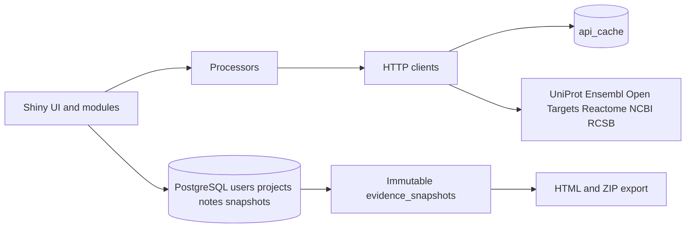

# TargetWeave

Private R Shiny workspace for investigating molecular targets in one disease context.

Human-only v1. Confirmed identities drive retrieval from public sources. Research notes and evidence snapshots are the durable record. Public API cache is reconstructable.

## Architecture



See `docs/architecture.md` for module boundaries and `R/process/process_invalidation.R` for live invalidation.

## Data sources

- UniProt — protein identity
- Ensembl — gene identity and genomic context
- Open Targets — target–disease association evidence
- Reactome — pathway membership, not enrichment
- NCBI PubMed — literature landscape without abstracts
- RCSB PDB — experimental structures only (no AlphaFold)

Account email and notes are not sent to those APIs. Scientific identifiers and query terms are sent when retrieval is requested.

## Local setup

System libraries (Ubuntu/Debian): `sudo apt install libpq-dev libsodium-dev`

R packages: `source("scripts/install_packages.R")` or restore from `DESCRIPTION` / `renv.lock`. Runtime packages must be declared; do not rely on a developer library.

PostgreSQL:

```bash
cp .Renviron.example .Renviron
# set PGPASSWORD
docker compose up -d db
```

`docker-compose.yml` is development Postgres only.

Run: `shiny::runApp()` from the repository root. Static files come from `www/` (`styles.css`, `tour.js`, `auth.js`, `logo.svg`) via Shiny, not absolute paths.

If PostgreSQL is down at startup, the process exits. It does not run without persistence.

Health: `GET /healthz` reports app name and whether the database answers `SELECT 1`. It does not call scientific APIs.

## Environment

| Variable | Role |
| --- | --- |
| `TW_ENV` | `development`, `test`, or `production` |
| `PGHOST` `PGPORT` `PGDATABASE` `PGUSER` `PGPASSWORD` `PGSSLMODE` | PostgreSQL |
| `NCBI_TOOL` `NCBI_EMAIL` `NCBI_API_KEY` | NCBI identity (key optional) |
| `UNIPROT_CONTACT_EMAIL` | User-Agent contact |
| `TW_HTTP_TIMEOUT` | External HTTP timeout seconds (default 20) |
| `TW_TEST_SCHEMA` | Test schema name (`tw_test`) |

`TESTTHAT=true` (set by testthat, not by UI input) attaches `tw_test`. `TW_ENV=production` refuses that schema.

Do not commit `.Renviron`. Example file contains placeholders only.

## Tests

Default: `source("tests/testthat.R")` — uses `tw_test`, skips if Postgres is missing, does not call live APIs.

Live: `TW_LIVE_API=1 Rscript tests/testthat.R`

When live tests show schema drift, refresh fixtures intentionally. See `docs/operations.md`.

## Snapshots and export

Snapshots freeze project context, identities, and retrieved evidence as JSONB. Live project edits never rewrite old snapshots. HTML/ZIP export reads snapshot JSON and writes to temp files only. PDF is deferred.

## Docker

The image restores **runtime packages from `renv.lock`** into the image library. It does not copy a developer library or `.Renviron`. Pass `PG*` and NCBI identity at runtime.

`renv.lock` was completed in the RC pass to include `httr2` and `ggplot2` (they were previously missing from the lockfile while listed in `DESCRIPTION`).

## Deployment

Not deployed in this milestone. Recommended target: a single Docker host or VM with PostgreSQL (managed) and HTTPS in front of the Shiny process. See `docs/operations.md`.

## Known limitations

See `docs/known-limitations.md`.
