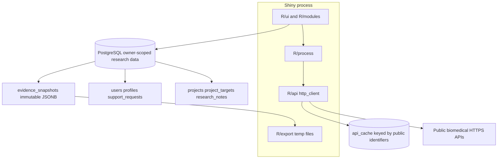

# Architecture

## Layers

- **UI / modules:** auth, project list/setup/home, identity resolvers, Overview, Open Targets evidence, Compare, Pathways, Literature, Structures, Notes/Snapshots, Account Center.
- **Processors:** identity, overview, disease, comparison, Reactome membership, literature, structures, snapshot freeze, live invalidation.
- **API clients:** finite timeout, bounded retry on 429/5xx, NCBI rate limit, no password or note bodies.
- **PostgreSQL:** private research state. Queries join owner `user_id`. `api_cache` is a shared public-source cache, not a snapshot store.

## Live invalidation

Documented in `R/process/process_invalidation.R`.

- Title / research question: presentation only.
- Target identity: Overview, Open Targets, Compare, Reactome, Literature, Structures.
- Disease identity: Open Targets, Compare, Literature.
- Snapshots: never invalidated.
- Cache rows: not deleted on project edit.

## Persistence vs reconstructable data

Durable: users, projects, notes, snapshots, support requests.

Reconstructable: `api_cache`.

## Project deletion

Not implemented. Archive hides a project from the default list and is restorable. Foreign keys would CASCADE snapshots and notes if delete were added later — do not add accidental cascades in application startup.

## Sessions

Shiny session plus server-side password hashes (sodium). Sign-out clears ids and reloads the session. Production should serve HTTPS.
